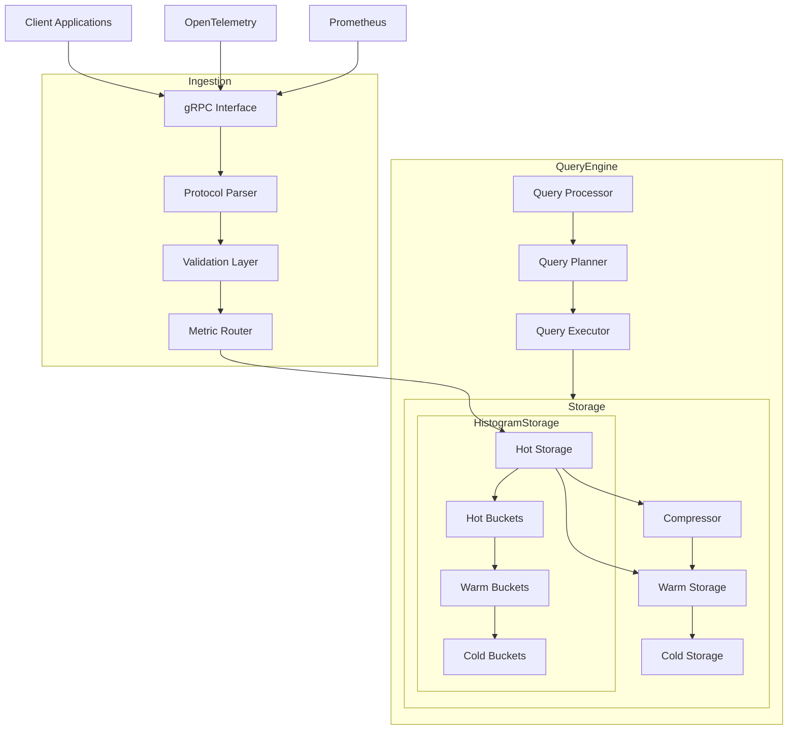
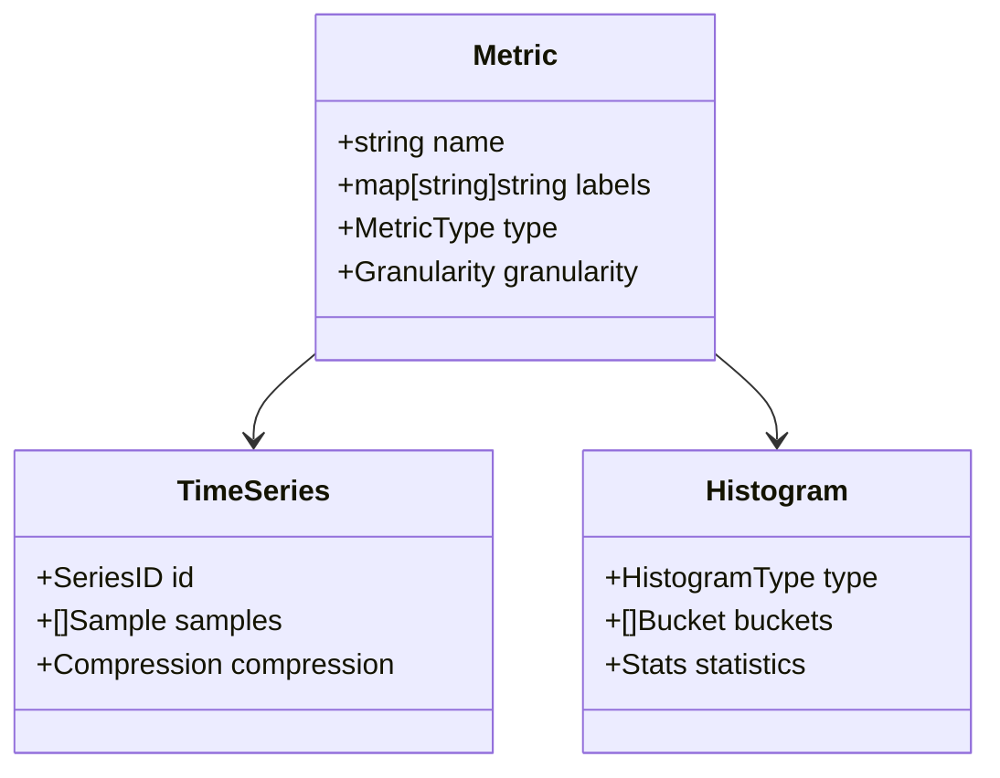
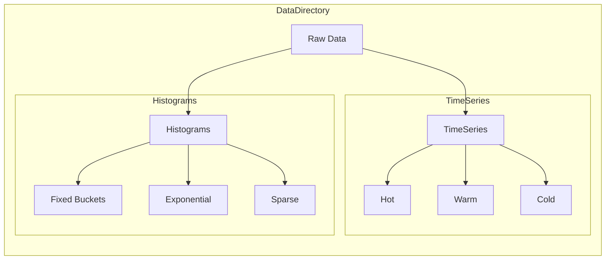
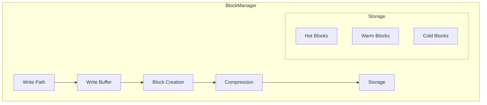
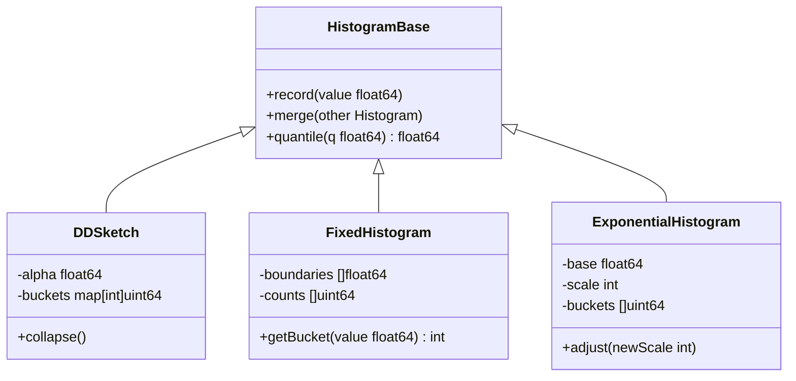
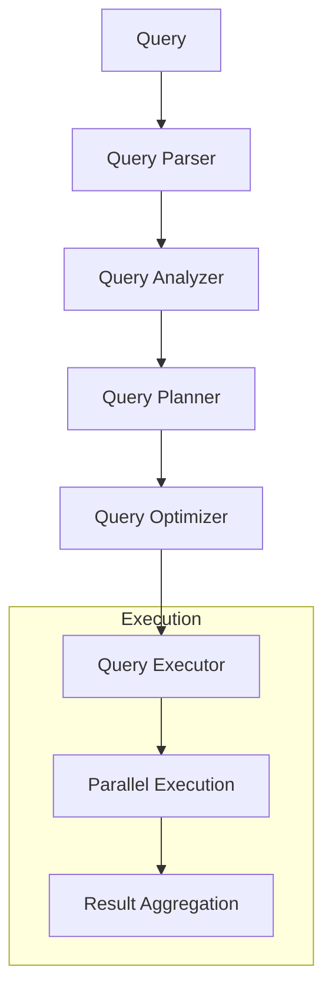

# TSDB Design Document

## Table of Contents
1. [Overview](#overview)
2. [Architecture](#architecture)
3. [Data Model](#data-model)
4. [Storage Engine](#storage-engine)
5. [Query Engine](#query-engine)
6. [Histogram Support](#histogram-support)
7. [Performance Optimizations](#performance-optimizations)
8. [Implementation Plan](#implementation-plan)

## Overview

This document describes the design of a high-performance time series database with support for both Go and C++ implementations. The database is designed to handle high-throughput metric ingestion with configurable granularity and efficient histogram support.

### Key Features
- OpenTelemetry (OTEL) Metrics support over gRPC
- Configurable per-metric granularity
- Efficient histogram storage and querying
- SIMD-optimized operations
- Multi-level storage architecture

## Architecture



## Data Model

### Metric Types


### Storage Layout


## Storage Engine

### Compression Strategy
Selected approach: Hybrid compression combining temporal and spatial techniques

1. Temporal Compression:
   - XOR encoding for timestamps
   - Delta-of-delta encoding for values
   - Run-length encoding for repeated values

2. Spatial Compression:
   - Dictionary encoding for labels
   - Gorilla compression for values
   - Zero-suppression for sparse data

### Block Management


## Histogram Support

### Selected Implementation
We've chosen a hybrid approach combining:
1. DDSketch for accurate quantile estimation
2. Fixed buckets for compatibility
3. Exponential histograms for OTEL support



### SIMD Optimizations
```cpp
// AVX-512 optimized operations
struct SIMDHistogram {
    alignas(64) float boundaries[16];
    alignas(64) uint32_t counts[16];
    alignas(64) float sums[16];
};
```

## Query Engine

### Query Planning


## Performance Optimizations

### Memory Management
1. Thread-local write buffers
2. Lock-free data structures
3. SIMD-friendly memory layout
4. Memory-mapped files for warm data

### Concurrency
1. Multi-version concurrency control (MVCC)
2. Lock-free read paths
3. Parallel query execution
4. Background compaction

## Implementation Plan

### Phase 1: Core Infrastructure (Week 1-2)
- [ ] Basic storage engine
- [ ] OTEL integration
- [ ] Simple query engine

### Phase 2: Advanced Features (Week 3-4)
- [ ] Histogram support
- [ ] SIMD optimizations
- [ ] Advanced compression

### Phase 3: Performance (Week 5-6)
- [ ] Query optimization
- [ ] Caching layer
- [ ] Benchmarking suite

### Phase 4: Production Readiness (Week 7-8)
- [ ] Monitoring
- [ ] Administration tools
- [ ] Documentation

## Directory Structure
```
/
├── cmd/                    # Command-line tools
├── internal/
│   ├── compression/       # Compression algorithms
│   ├── storage/          # Storage engine
│   ├── query/           # Query engine
│   ├── histogram/       # Histogram implementation
│   └── otel/           # OpenTelemetry integration
├── pkg/                # Public APIs
└── test/              # Test suites
```

## Technical Specifications

### Storage Engine Interfaces

```go
// Go Implementation
type Storage interface {
    // Core operations
    Write(series *TimeSeries) error
    Read(id SeriesID, start, end int64) (*TimeSeries, error)
    Query(matchers []LabelMatcher, start, end int64) ([]*TimeSeries, error)
    
    // Histogram operations
    WriteHistogram(h *Histogram) error
    ReadHistogram(id SeriesID, start, end int64) (*Histogram, error)
    
    // Management
    Compact() error
    Flush() error
    Close() error
}
```

```cpp
// C++ Implementation
class Storage {
public:
    // Core operations
    virtual Result<void> write(const TimeSeries& series) = 0;
    virtual Result<TimeSeries> read(SeriesID id, int64_t start, int64_t end) = 0;
    virtual Result<std::vector<TimeSeries>> query(
        const std::vector<LabelMatcher>& matchers,
        int64_t start, int64_t end) = 0;
    
    // Histogram operations
    virtual Result<void> writeHistogram(const Histogram& histogram) = 0;
    virtual Result<Histogram> readHistogram(
        SeriesID id, int64_t start, int64_t end) = 0;
    
    // Management
    virtual Result<void> compact() = 0;
    virtual Result<void> flush() = 0;
    virtual ~Storage() = default;
};
```

### Block Format Specification

```plaintext
Block Header (32 bytes)
+----------------+----------------+----------------+----------------+
|   Magic (8B)   | Version (4B)  | Flags (4B)    | CRC32 (4B)    |
+----------------+----------------+----------------+----------------+
| Start Time (8B)| End Time (8B) |  Reserved (4B)|
+----------------+----------------+----------------+

Series Block
+----------------+----------------+----------------+
| Series Count   | Label Count   | Sample Count   |
+----------------+----------------+----------------+
| Label Section  | Sample Section| Index Section  |
+----------------+----------------+----------------+

Histogram Block
+----------------+----------------+----------------+
| Histogram Type | Bucket Count  | Sample Count   |
+----------------+----------------+----------------+
| Config Section | Bucket Section| Index Section  |
+----------------+----------------+----------------+
```

### Compression Formats

```plaintext
1. Timestamp Compression (XOR Delta-of-Delta)
   [Base Timestamp 8B][Delta Initial 8B][Blocks...]
   Block: [Control Byte 1B][Delta Bits 1-8B]

2. Value Compression (Gorilla)
   [First Value 8B][Blocks...]
   Block: [Control Byte 1B][XOR Bits 1-8B]

3. Histogram Compression
   [Config 4B][Bucket Boundaries...][Compressed Counts...]
   Count Block: [RLE Header 1B][Count Data 1-8B]
```

### SIMD Operations

```cpp
// AVX-512 Histogram Operations
struct SIMDOps {
    // Update 16 buckets simultaneously
    static void updateBuckets(
        __m512 values,          // Input values
        __m512 boundaries,      // Bucket boundaries
        __m512i& counts        // Bucket counts
    ) {
        __mmask16 mask = _mm512_cmp_ps_mask(values, boundaries, _CMP_LT_OS);
        counts = _mm512_mask_add_epi32(counts, mask, counts, _mm512_set1_epi32(1));
    }
    
    // Merge histograms
    static void mergeBuckets(
        __m512i& target,       // Target histogram
        __m512i source        // Source histogram
    ) {
        target = _mm512_add_epi32(target, source);
    }
};
```

### Query Optimization Rules

```plaintext
1. Time Range Selection
   - < 1h: Use hot storage
   - 1h-24h: Use warm storage
   - > 24h: Use cold storage + aggregates

2. Cardinality Estimation
   Rule: estimated_series = unique_labels * time_range / granularity
   Action:
   - Low (<10K): Full scan
   - Medium (10K-1M): Index scan
   - High (>1M): Approximate query

3. Histogram Query Optimization
   - Use pre-computed quantiles for common percentiles
   - Parallel bucket processing for large histograms
   - Dynamic bucket merging for sparse regions
```

### Configuration Parameters

```yaml
storage:
  block_size: 64MB
  max_hot_blocks: 4
  warm_cache_size: 1GB
  compression:
    algorithm: gorilla
    dictionary_size: 10000
  
histogram:
  max_buckets: 200
  ddsketch_alpha: 0.01
  simd_enabled: true
  
query:
  max_concurrent: 32
  timeout: 30s
  cache_size: 1GB
  
otel:
  batch_size: 1000
  buffer_size: 10000
  workers: 4
```

### Performance SLOs

```plaintext
Write Path:
- Latency: P99 < 10ms
- Throughput: > 1M samples/sec/core
- Memory: < 1KB per active series

Read Path:
- Latency: P99 < 100ms for 1y queries
- Throughput: > 100K samples/sec/core
- Cache Hit Ratio: > 95%

Histogram Operations:
- Record: < 100ns
- Merge: < 1μs per histogram
- Quantile Query: < 10μs
```

## Error Handling

```go
// Go Implementation
type Error struct {
    Code    ErrorCode
    Message string
    Cause   error
}

type ErrorCode int

const (
    ErrNotFound ErrorCode = iota
    ErrCorruption
    ErrTimeout
    ErrConcurrencyConflict
)
```

```cpp
// C++ Implementation
class Error : public std::exception {
public:
    enum class Code {
        NotFound,
        Corruption,
        Timeout,
        ConcurrencyConflict
    };
    
    Code code() const noexcept;
    const char* what() const noexcept override;
};
```

## Monitoring Metrics

```plaintext
1. Write Path Metrics
   - write_requests_total
   - write_errors_total
   - write_latency_seconds
   - active_series_count
   - compression_ratio

2. Read Path Metrics
   - query_requests_total
   - query_errors_total
   - query_latency_seconds
   - cache_hit_ratio
   - scan_bytes_total

3. Resource Usage
   - memory_bytes
   - disk_bytes
   - goroutines_count
   - cpu_seconds_total
``` 