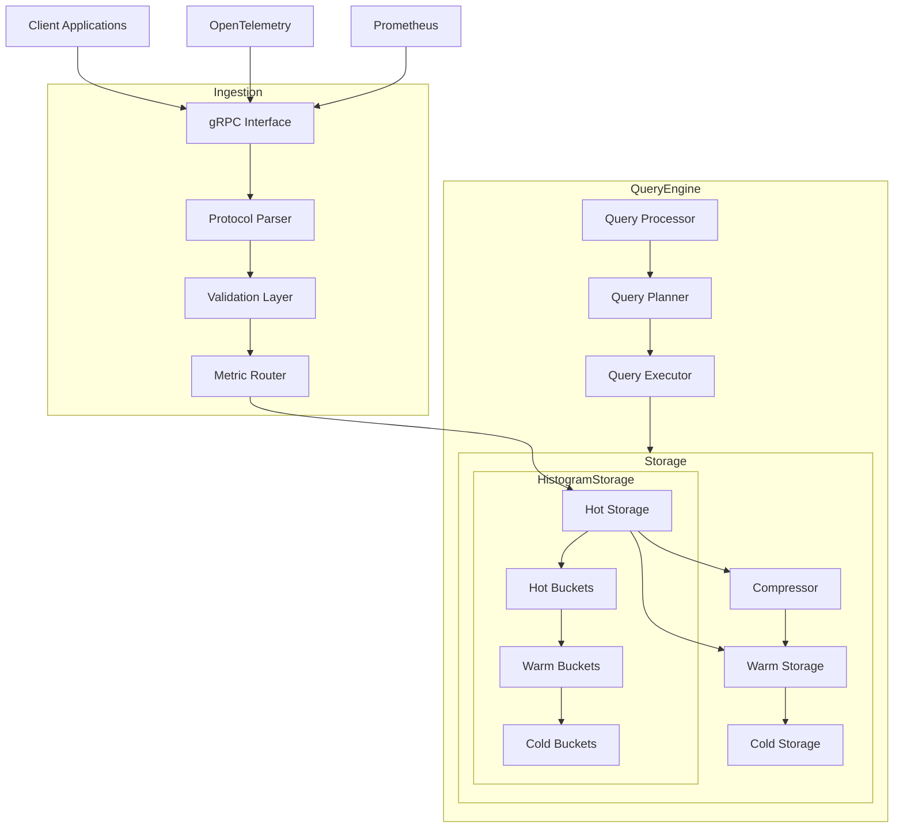
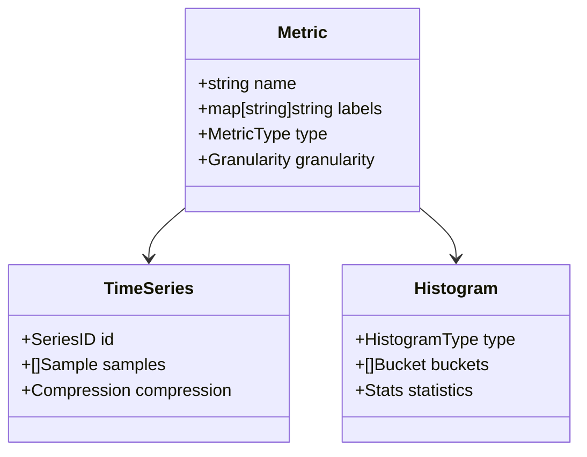
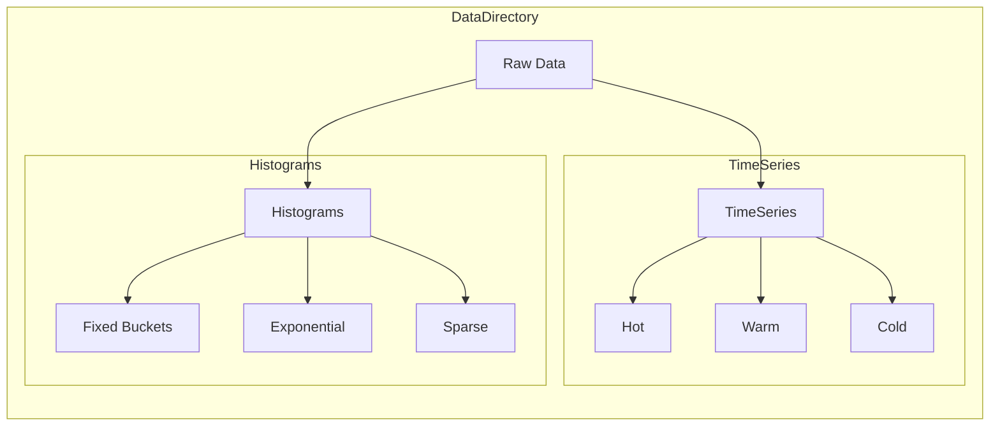
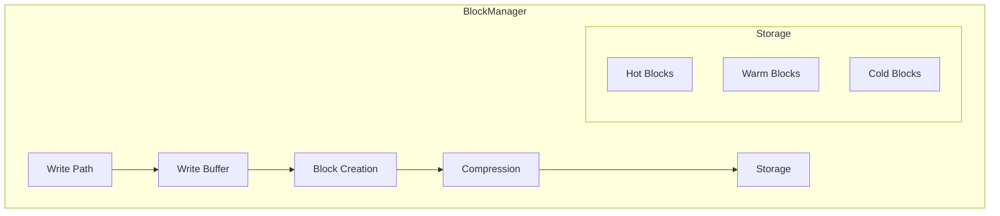
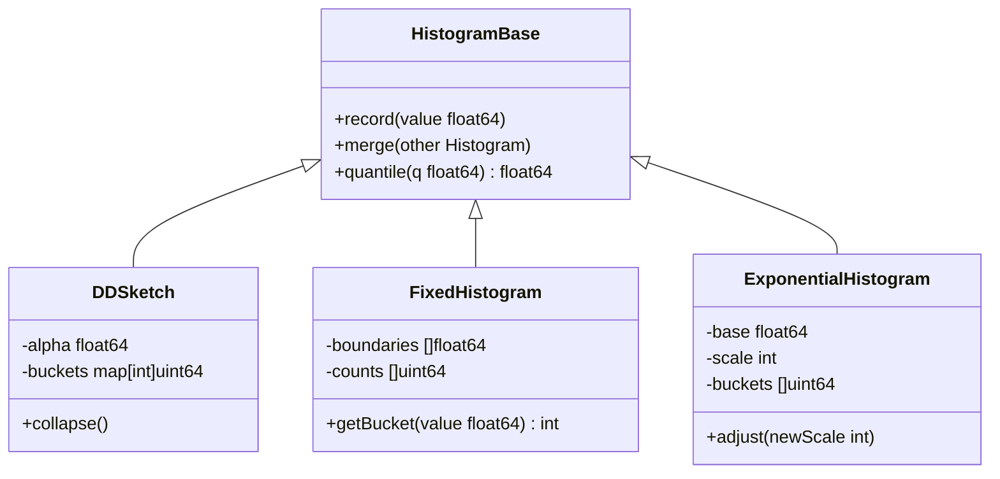
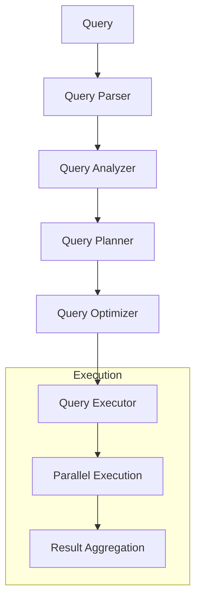

# TSDB Architecture Diagrams

## System Architecture

```mermaid
graph TB
    Client[Client Applications] --> GRPC[gRPC Interface]
    OTEL[OpenTelemetry] --> GRPC
    Prometheus[Prometheus] --> GRPC
    
    subgraph Ingestion
        GRPC --> Parser[Protocol Parser]
        Parser --> Validator[Validation Layer]
        Validator --> Router[Metric Router]
    end
    
    subgraph Storage
        Router --> Hot[Hot Storage]
        Hot --> Warm[Warm Storage]
        Warm --> Cold[Cold Storage]
        
        Hot --> Compressor[Compressor]
        Compressor --> Warm
        
        subgraph HistogramStorage
            Hot --> HBuckets[Hot Buckets]
            HBuckets --> WBuckets[Warm Buckets]
            WBuckets --> CBuckets[Cold Buckets]
        end
    end
    
    subgraph QueryEngine
        Query[Query Processor] --> Planner[Query Planner]
        Planner --> Executor[Query Executor]
        Executor --> Storage
    end
```

## Data Model

```mermaid
classDiagram
    class Metric {
        +string name
        +map[string]string labels
        +MetricType type
        +Granularity granularity
    }
    
    class TimeSeries {
        +SeriesID id
        +[]Sample samples
        +Compression compression
    }
    
    class Histogram {
        +HistogramType type
        +[]Bucket buckets
        +Stats statistics
    }
    
    Metric --> TimeSeries
    Metric --> Histogram
```

## Storage Layout

```mermaid
graph LR
    subgraph DataDirectory
        Raw[Raw Data] --> TS[TimeSeries]
        Raw --> Hist[Histograms]
        
        subgraph TimeSeries
            TS --> TS_Hot[Hot]
            TS --> TS_Warm[Warm]
            TS --> TS_Cold[Cold]
        end
        
        subgraph Histograms
            Hist --> H_Fixed[Fixed Buckets]
            Hist --> H_Exp[Exponential]
            Hist --> H_Sparse[Sparse]
        end
    end
```

## Block Management

```mermaid
graph TB
    subgraph BlockManager
        Write[Write Path] --> Buffer[Write Buffer]
        Buffer --> Blocks[Block Creation]
        Blocks --> Compress[Compression]
        Compress --> Store[Storage]
        
        subgraph Storage
            Hot[Hot Blocks]
            Warm[Warm Blocks]
            Cold[Cold Blocks]
        end
    end
```

## Histogram Class Diagram

```mermaid
classDiagram
    class HistogramBase {
        +record(value float64)
        +merge(other Histogram)
        +quantile(q float64) float64
    }
    
    class DDSketch {
        -alpha float64
        -buckets map[int]uint64
        +collapse()
    }
    
    class FixedHistogram {
        -boundaries []float64
        -counts []uint64
        +getBucket(value float64) int
    }
    
    class ExponentialHistogram {
        -base float64
        -scale int
        -buckets []uint64
        +adjust(newScale int)
    }
    
    HistogramBase <|-- DDSketch
    HistogramBase <|-- FixedHistogram
    HistogramBase <|-- ExponentialHistogram
```

## Query Planning Flow

```mermaid
graph TB
    Query[Query] --> Parser[Query Parser]
    Parser --> Analyzer[Query Analyzer]
    Analyzer --> Planner[Query Planner]
    Planner --> Optimizer[Query Optimizer]
    Optimizer --> Executor[Query Executor]
    
    subgraph Execution
        Executor --> ParallelExec[Parallel Execution]
        ParallelExec --> Results[Result Aggregation]
    end
``` 