# TSDB Architecture Diagrams

**Updated**: July 2025  
**Status**: Comprehensive architecture reflecting all implemented features and integration plans

## System Architecture Overview
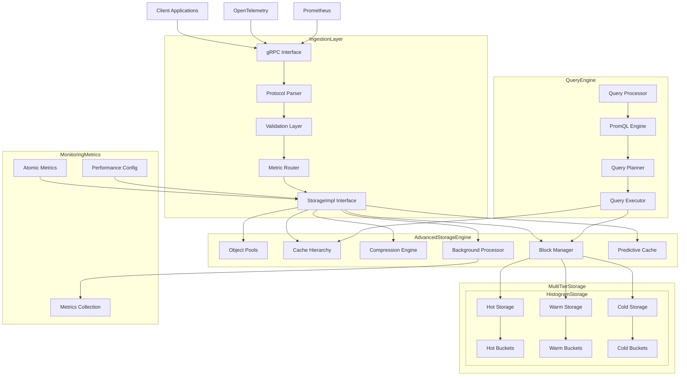

## StorageImpl Integration Architecture
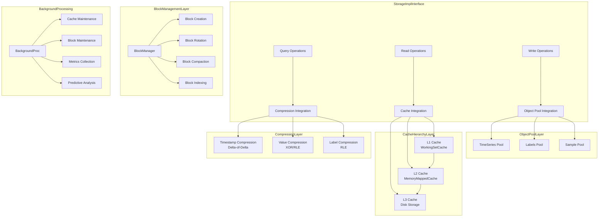

## Advanced Features Architecture
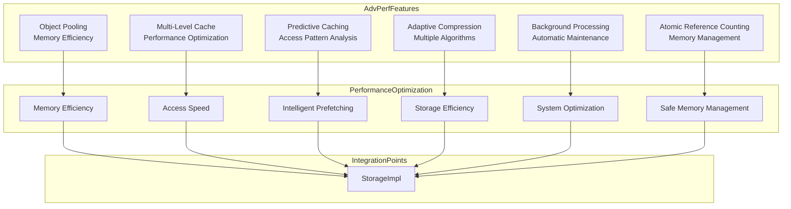

## Data Model with Advanced Features
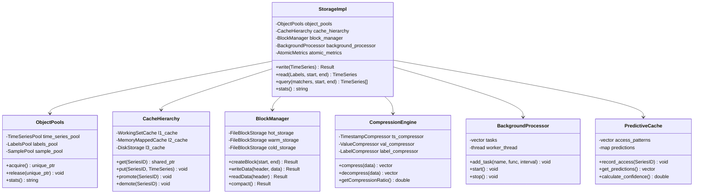

## Multi-Tier Storage Architecture
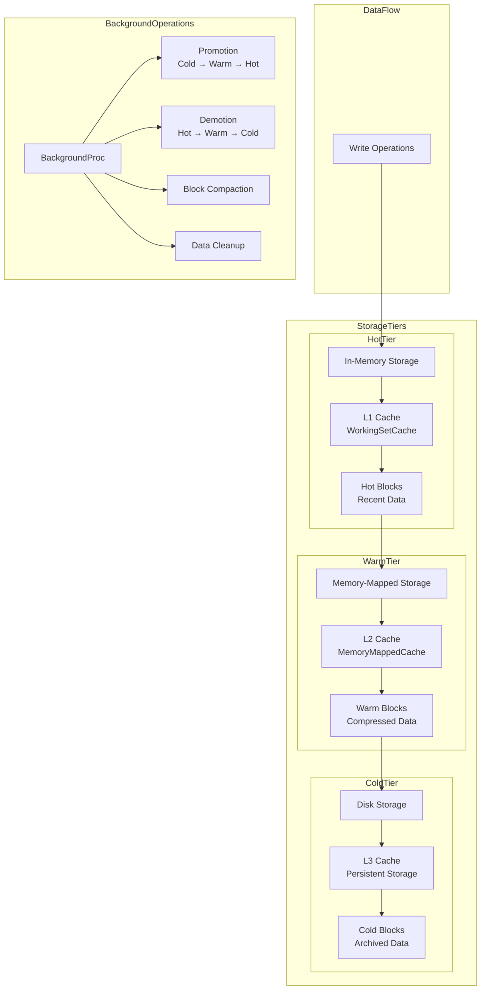

## Compression Architecture
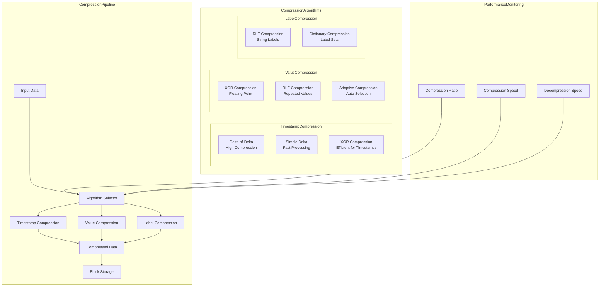

## Cache Hierarchy Architecture
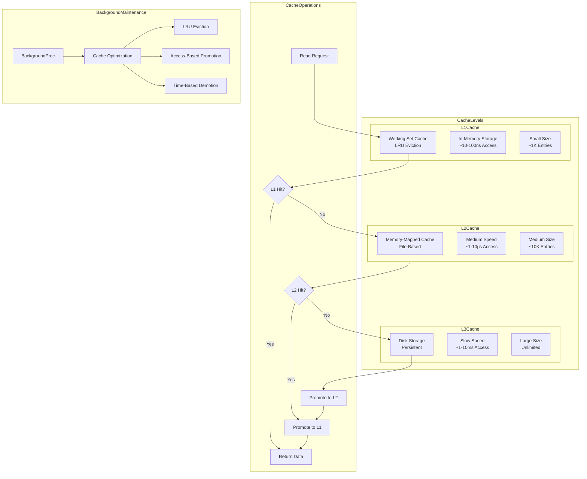

## Block Management Architecture
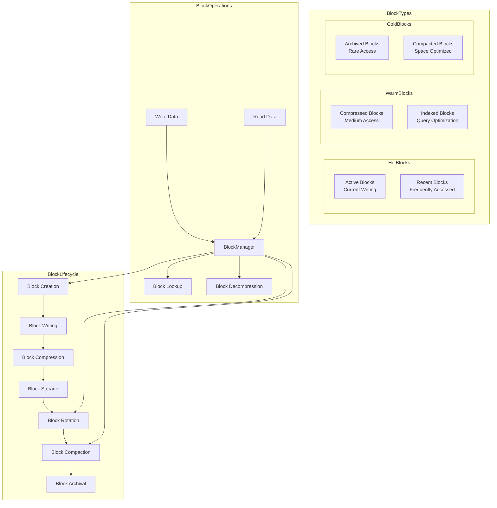

## Background Processing Architecture
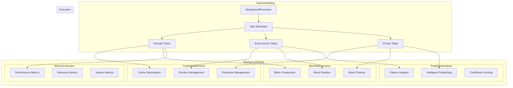

## Query Processing Architecture
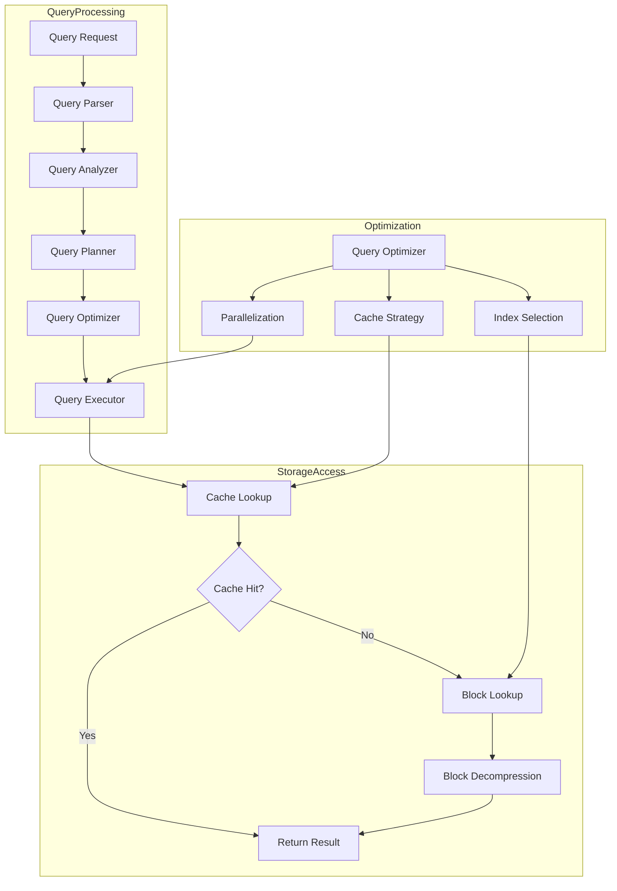

## Performance Monitoring Architecture
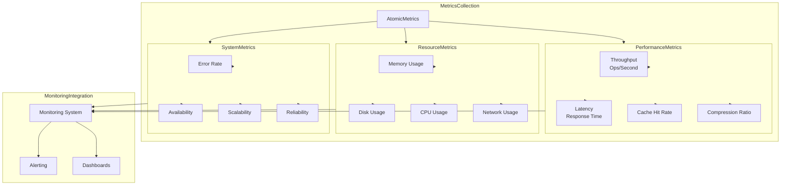

## Integration Testing Architecture
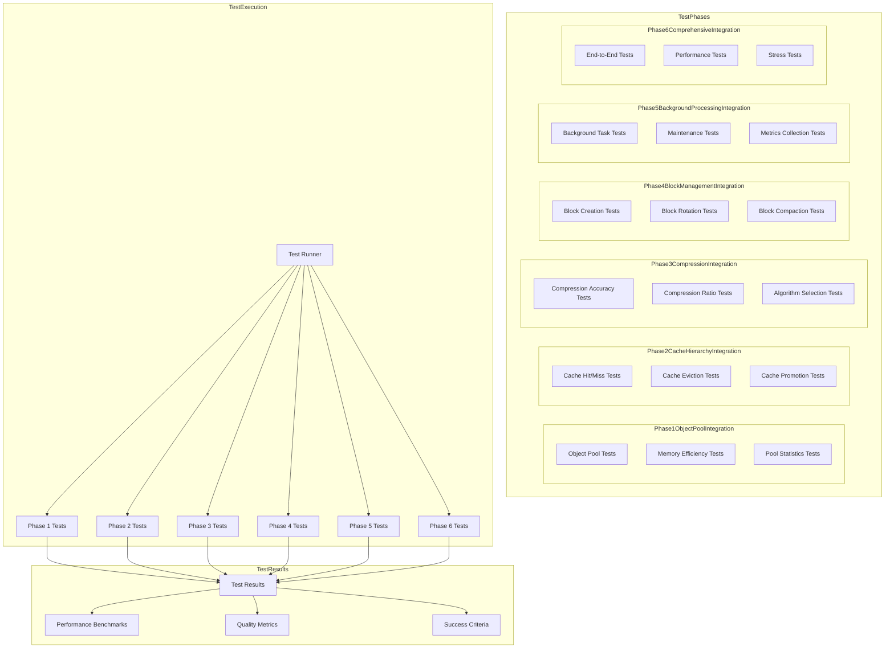