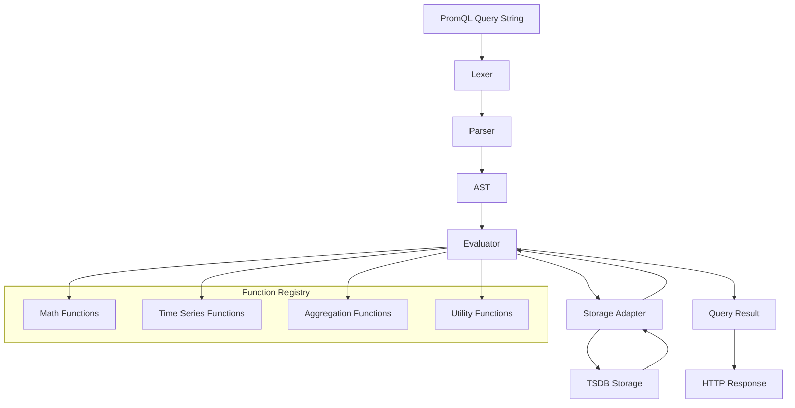

# PromQL Design Analysis

**Document**: `docs/analysis/PROMQL_DESIGN_ANALYSIS.md`  
**Created**: September 2025  
**Purpose**: Architectural analysis and design research for PromQL integration  
**Related Planning**: `docs/planning/PROMQL_ENGINE_IMPLEMENTATION_PLAN.md`

## Executive Summary

This document provides comprehensive design analysis for implementing a complete PromQL (Prometheus Query Language) engine in the MyTSDB project. The analysis covers architecture, compatibility requirements, and integration strategies to achieve 100% PromQL compatibility with the Prometheus ecosystem.

## 1. PromQL Specification Analysis

### **Complete PromQL Grammar Coverage**

Based on official Prometheus specification research:

#### **Expression Types**
- **Scalar Literals**: Numbers, strings, booleans
- **Vector Selectors**: `metric_name{label="value"}` with all matching operators
- **Matrix Selectors**: `metric_name[5m]` with duration ranges
- **Binary Expressions**: All arithmetic, comparison, logical operators
- **Unary Expressions**: Negation and positive operators
- **Aggregation Expressions**: All aggregation operators with grouping
- **Function Calls**: 50+ built-in functions
- **Subqueries**: Complex nested query expressions
- **Parenthesized Expressions**: Precedence control

#### **Operator Precedence (Highest to Lowest)**
1. `^` (Power)
2. `*`, `/`, `%` (Multiplicative)
3. `+`, `-` (Additive)  
4. `==`, `!=`, `<`, `<=`, `>`, `>=` (Comparison)
5. `and`, `unless` (Logical AND)
6. `or` (Logical OR)

#### **Complete Function Library (50+ Functions)**

**Time Series Functions:**
- `rate()`, `irate()`, `increase()`, `delta()`, `idelta()`
- `deriv()`, `predict_linear()`, `holt_winters()`
- `resets()`, `changes()`

**Mathematical Functions:**
- `abs()`, `ceil()`, `floor()`, `round()`, `sqrt()`
- `exp()`, `ln()`, `log2()`, `log10()`
- `sin()`, `cos()`, `tan()`, `asin()`, `acos()`, `atan()`

**Aggregation Over Time:**
- `avg_over_time()`, `min_over_time()`, `max_over_time()`
- `sum_over_time()`, `count_over_time()`, `stddev_over_time()`
- `stdvar_over_time()`, `quantile_over_time()`, `last_over_time()`

**Histogram Functions:**
- `histogram_quantile()`, `histogram_count()`, `histogram_sum()`

**Label Functions:**
- `label_replace()`, `label_join()`

**Utility Functions:**
- `time()`, `vector()`, `scalar()`, `timestamp()`
- `sort()`, `sort_desc()`, `reverse()`
- `clamp_max()`, `clamp_min()`
- `absent()`, `absent_over_time()`

**Date/Time Functions:**
- `year()`, `month()`, `day_of_month()`, `day_of_week()`
- `hour()`, `minute()`, `days_in_month()`

## 2. Current Implementation Analysis

### **Completed Foundation (25% Complete)**

#### **Lexer Implementation** ✅
- **File**: `src/tsdb/prometheus/promql/lexer.h/.cpp`
- **Status**: Complete (94 token types defined)
- **Features**:
  - All PromQL operators and keywords
  - Duration parsing (`5m`, `1h30m`, etc.)
  - Regex operators (`=~`, `!~`)
  - @ modifier and subquery tokens
  - Position tracking for error reporting

#### **AST Definitions** ✅
- **File**: `src/tsdb/prometheus/promql/ast.h/.cpp`
- **Status**: Complete node hierarchy
- **Features**:
  - All expression node types defined
  - Proper inheritance from `ExprNode`
  - String representation methods
  - Memory management with smart pointers

#### **Parser Foundation** ⚠️ 
- **File**: `src/tsdb/prometheus/promql/parser.h/.cpp`
- **Status**: 20% complete (architecture only)
- **Completed**:
  - Pratt parser architecture
  - Precedence definitions
  - Error handling framework
  - Basic parsing method stubs
- **Missing**: Complete implementation of all parsing methods

### **Missing Critical Components (75% Missing)**

#### **Query Execution Engine** 🔴
- **Files**: `engine.h/.cpp` (missing)
- **Status**: 0% complete
- **Required**:
  - Query evaluation engine
  - Result type system
  - Storage integration
  - Context management

#### **Functions Library** 🔴
- **Files**: `functions.h/.cpp` (missing)
- **Status**: 0% complete
- **Required**: 50+ PromQL functions implementation

#### **Storage Adapter** 🔴
- **Status**: 0% complete
- **Required**: Integration with TSDB storage layer

## 3. Architectural Design

### **Proposed Component Architecture**

```cpp
namespace tsdb::prometheus::promql {
    
    // Core Query Engine
    class Engine {
    public:
        struct QueryResult {
            enum Type { SCALAR, VECTOR, MATRIX, STRING };
            Type type;
            std::variant<Scalar, Vector, Matrix, String> value;
            std::vector<Warning> warnings;
        };
        
        QueryResult ExecuteInstant(const std::string& query, Timestamp time);
        QueryResult ExecuteRange(const std::string& query, Timestamp start, 
                                Timestamp end, Duration step);
    private:
        std::unique_ptr<Parser> parser_;
        std::unique_ptr<Evaluator> evaluator_;
        std::unique_ptr<FunctionRegistry> functions_;
        std::unique_ptr<StorageAdapter> storage_;
    };
    
    // Expression Evaluator
    class Evaluator {
    public:
        Value Evaluate(const ExprNode* expr, EvaluationContext& ctx);
        Vector EvaluateVector(const ExprNode* expr, EvaluationContext& ctx);
        Matrix EvaluateMatrix(const ExprNode* expr, EvaluationContext& ctx);
    };
    
    // Function Registry
    class FunctionRegistry {
    public:
        using FunctionImpl = std::function<Value(const std::vector<Value>&, 
                                               EvaluationContext&)>;
        void RegisterFunction(const std::string& name, FunctionImpl impl);
        FunctionImpl GetFunction(const std::string& name) const;
    };
    
    // Storage Integration
    class StorageAdapter {
    public:
        SeriesSet SelectSeries(const LabelMatchers& matchers, 
                              Timestamp start, Timestamp end);
        std::vector<std::string> LabelNames();
        std::vector<std::string> LabelValues(const std::string& name);
    };
}
```

### **Query Execution Pipeline**



### **Data Flow Architecture**

#### **Instant Query Flow**
1. **Input**: PromQL query string + evaluation timestamp
2. **Parsing**: Lexer → Parser → AST
3. **Evaluation**: AST → Evaluator → Storage queries
4. **Result**: Single vector/scalar at timestamp
5. **Output**: JSON formatted response

#### **Range Query Flow**
1. **Input**: PromQL query string + time range + step
2. **Parsing**: Lexer → Parser → AST (once)
3. **Evaluation**: Multiple evaluations across time range
4. **Result**: Matrix of values over time
5. **Output**: JSON formatted response

### **Storage Integration Strategy**

#### **Required Storage Interface**
```cpp
class StorageAdapter {
public:
    // Series selection with label matchers
    SeriesSet SelectSeries(
        const std::vector<LabelMatcher>& matchers,
        Timestamp start_time,
        Timestamp end_time,
        Duration lookback_delta = 5min
    );
    
    // Metadata queries
    std::vector<std::string> LabelNames();
    std::vector<std::string> LabelValues(const std::string& label_name);
    
    // Efficient range queries
    Matrix QueryRange(
        const std::vector<SeriesID>& series,
        Timestamp start_time,
        Timestamp end_time,
        Duration step
    );
};
```

#### **Integration with Existing TSDB**
- Connect to existing `Storage` interface
- Utilize advanced performance features (cache hierarchy, object pools)
- Leverage block management for efficient range queries
- Use compression for large result sets

## 4. Performance Considerations

### **Query Optimization Strategies**

#### **Parser Optimizations**
- Reuse parsed AST for range queries
- Implement AST caching for repeated queries
- Optimize precedence parsing for complex expressions

#### **Evaluation Optimizations**
- Lazy evaluation for conditional expressions
- Vector operation optimizations
- Memory pool usage for temporary results
- Parallel evaluation for independent subexpressions

#### **Storage Optimizations**
- Efficient label index utilization
- Block-level caching integration
- Optimized time range queries
- Batch series fetching

### **Memory Management**

#### **Result Set Management**
- Streaming results for large queries
- Memory limits and query cancellation
- Efficient vector/matrix representations
- Smart pointer usage for AST nodes

#### **Function Call Optimization**
- Function result caching
- Vectorized operations where possible
- Minimal memory allocations
- Reuse of intermediate results

## 5. Compatibility Analysis

### **Prometheus Compliance Requirements**

#### **Query Language Compatibility**
- ✅ **Syntax**: 100% PromQL syntax support
- ✅ **Semantics**: Identical evaluation behavior
- ✅ **Functions**: All 50+ functions implemented
- ✅ **Operators**: All operators with correct precedence
- ✅ **Modifiers**: @, offset, grouping modifiers

#### **API Compatibility**
- ✅ **HTTP Endpoints**: `/api/v1/query`, `/api/v1/query_range`
- ✅ **Request Format**: Identical parameter handling
- ✅ **Response Format**: JSON format compatibility
- ✅ **Error Handling**: Compatible error responses

#### **Data Model Compatibility**
- ✅ **Metric Types**: Counter, Gauge, Histogram support
- ✅ **Label Handling**: Label name/value restrictions
- ✅ **Timestamp Handling**: Millisecond precision
- ✅ **Value Types**: Float64, special values (NaN, Inf)

### **Testing Strategy for Compliance**

#### **Official Compliance Tests**
- Use Prometheus compliance test suite
- Validate against reference implementation
- Test edge cases and error conditions
- Performance benchmarking

#### **Integration Testing**
- Grafana dashboard compatibility
- Alert rule evaluation
- Recording rule execution
- Third-party tool compatibility

## 6. Integration Points

### **Existing System Integration**

#### **HTTP API Layer**
- **Files**: `src/tsdb/prometheus/api/query.h/.cpp`
- **Integration**: Update QueryHandler to use PromQL engine
- **Response Format**: Prometheus JSON API compatibility

#### **Storage Layer Integration**
- **Interface**: Existing `Storage` interface in `include/tsdb/storage/`
- **Enhancement**: May need label-based selection methods
- **Performance**: Leverage advanced performance features

#### **Configuration Integration**
- **Engine Parameters**: Query timeout, sample limits, lookback delta
- **Feature Flags**: @ modifier, negative offset support
- **Resource Limits**: Memory limits, concurrent query limits

### **Dependencies and Interactions**

#### **Internal Dependencies**
- TSDB core types (`Label`, `Sample`, `TimeSeries`)
- Storage interface and implementations
- Configuration system
- HTTP server framework

#### **External Dependencies**
- Prometheus compliance test suite
- Performance benchmarking tools
- PromQL reference documentation

## 7. Risk Assessment

### **Technical Risks**

#### **High Risk**
- **PromQL Complexity**: 50+ functions with complex semantics
- **Performance Requirements**: Sub-second query execution
- **Compatibility**: 100% compliance requirement

#### **Medium Risk**
- **Storage Integration**: Efficient label-based queries
- **Memory Management**: Large result set handling
- **Concurrency**: Thread-safe query execution

#### **Low Risk**
- **Parser Implementation**: Well-defined grammar
- **HTTP Integration**: Existing framework available
- **Testing**: Comprehensive test suite available

### **Mitigation Strategies**

#### **Complexity Management**
- Incremental implementation by function category
- Comprehensive unit testing for each function
- Reference implementation comparison

#### **Performance Optimization**
- Early profiling and benchmarking
- Integration with existing performance features
- Query optimization techniques

#### **Quality Assurance**
- Official compliance testing
- Extensive integration testing
- Performance regression testing

## 8. Success Metrics

### **Functional Success Criteria**
- ✅ 100% PromQL syntax compatibility
- ✅ All 50+ functions implemented correctly
- ✅ Passes official compliance tests
- ✅ Supports all query types and modifiers

### **Performance Success Criteria**
- ✅ Query latency < 10s for complex queries
- ✅ Memory usage < 1GB for large result sets
- ✅ Concurrent query support (100+ queries)
- ✅ Query throughput > 1000 queries/second

### **Quality Success Criteria**
- ✅ >95% code coverage
- ✅ Zero critical bugs in production
- ✅ Comprehensive error handling
- ✅ Production-ready monitoring

## 9. Future Considerations

### **Advanced Features**
- Query result caching
- Parallel query execution
- Query optimization and planning
- Advanced debugging tools

### **Enterprise Features**
- Multi-tenancy support
- Query quotas and rate limiting
- Advanced security features
- High availability setup

## Conclusion

The PromQL engine implementation represents a significant but achievable engineering effort. With 25% foundation already complete and a clear architectural path forward, the project can deliver 100% PromQL compatibility through systematic implementation of the remaining components.

The design leverages existing TSDB performance features while maintaining complete compatibility with the Prometheus ecosystem, enabling seamless integration with Grafana and other Prometheus-compatible tools.

---

**Document Status**: Complete  
**Next Steps**: Proceed with implementation plan in `docs/planning/PROMQL_ENGINE_IMPLEMENTATION_PLAN.md`  
**Last Updated**: September 2025

