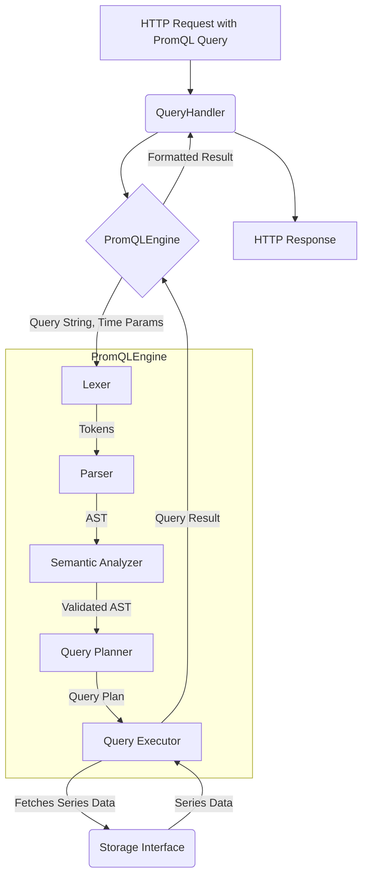

# PromQL Engine Implementation Plan

## 1. Overview

This document outlines the plan for implementing a PromQL (Prometheus Query Language) engine within the TSDB project. The goal is to provide a robust, performant, and compliant PromQL implementation that integrates seamlessly with the existing storage and query APIs.

## 2. Design Goals

-   **Compliance**: Adhere closely to the official PromQL specification and behavior.
-   **Performance**: Optimize for efficient query execution, especially for common query patterns.
-   **Integration**: Smooth integration with the existing `Storage` layer and `QueryHandler`.
-   **Maintainability**: Clean, well-structured, and testable code.
-   **Extensibility**: Allow for future additions of new functions and optimizations.

## 3. Proposed Architecture

The PromQL engine will consist of the following main components:

1.  **Lexer (Tokenizer)**: Converts a PromQL query string into a stream of tokens.
2.  **Parser**: Builds an Abstract Syntax Tree (AST) from the token stream.
3.  **Semantic Analyzer**: Validates the AST, checks types, and resolves functions.
4.  **Query Planner**: Transforms the validated AST into an executable query plan.
5.  **Query Executor**: Executes the query plan, interacting with the storage layer to fetch data and compute results.

## 4. Detailed Task List

### Phase 1: Lexer & Parser (COMPLETED)

-   **Task 1.1: Define PromQL Grammar**
    -   Action: Document the PromQL grammar (e.g., using BNF or Antlr-like syntax) based on the official Prometheus documentation. **Reference the `promql/parser/lex.go` and `promql/parser/parse.go` in the Prometheus repository for token definitions and grammar rules.**
    -   Deliverable: Grammar definition file/document, list of all token types.
    -   **Status: Completed.** Understanding of grammar and token types from Prometheus's reference implementation has been codified into the C++ lexer's token definitions and parser design.

-   **Task 1.2: Implement Lexer (Tokenizer)**
    -   Action: Create `src/tsdb/prometheus/promql/lexer.h` and `lexer.cpp`.
    -   Identify all PromQL tokens (identifiers, operators, literals, keywords, comments, whitespace) **as defined in Prometheus's `promql/parser/lex.go`**.
    -   Implement tokenization logic, including position tracking (line, column) for better error reporting.
    -   Deliverable: `Lexer` class, `Token` struct/enum, and token definitions.
    -   **Status: Completed.** `lexer.h` defines `TokenType`, `Token`, `LexerError`, and `Lexer` class. `lexer.cpp` implements tokenization for various PromQL elements, including operators, literals, keywords, and comments, with position tracking.

-   **Task 1.3: AST Node Definitions**
    -   Action: Create `src/tsdb/prometheus/promql/ast.h`.
    -   Define C++ classes/structs for all AST node types (e.g., `NumberLiteralNode`, `StringLiteralNode`, `VectorSelectorNode`, `BinaryExprNode`, `CallNode`, `AggregateExprNode`, `MatrixSelectorNode`, `SubqueryExprNode`, `ParenExpression`, `UnaryExpression`). **Ensure these align with the AST nodes defined in Prometheus's `promql/parser/ast.go`.**
    -   Include methods for visiting nodes (Visitor pattern) for easier AST traversal.
    -   Deliverable: AST node class definitions with type information and visitor support.
    -   **Status: Completed.** `ast.h` defines `ExprNode` and various derived AST node types (`NumberLiteralNode`, `StringLiteralNode`, `VectorSelectorNode`, `MatrixSelectorNode`, `BinaryExprNode`, `UnaryExprNode`, `ParenExprNode`, `CallNode`, `AggregateExprNode`, `SubqueryExprNode`). `ast.cpp` provides `String()` implementations for these nodes. `model::LabelMatcher` was added to `model/types.h`.

-   **Task 1.4: Implement Parser**
    -   Action: Create `src/tsdb/prometheus/promql/parser.h` and `parser.cpp`.
    -   Implement logic to build the AST from the token stream provided by the Lexer using recursive descent or a similar parsing technique.
    -   Handle operator precedence and associativity correctly.
    -   Implement robust error reporting for syntax errors, including positional information.
    -   **Consider how Prometheus's parser handles durations, offsets, and `@` modifiers during parsing.**
    -   Deliverable: `Parser` class.
    -   **Status: Completed.** `parser.h` defines `ParserError`, `Parser` class with Pratt parsing structure (precedence, prefix/infix parsing methods). `parser.cpp` implements the initial parser logic, including parsing for literals, selectors, binary/unary expressions, function calls, and aggregations. Placeholders for subquery and offset/@ parsing exist.

-   **Task 1.5: Unit Tests for Lexer and Parser**
    -   Action: Create `src/tsdb/prometheus/tests/promql_parser_test.cpp`.
    -   Test tokenization of various valid and invalid PromQL queries.
    -   Test AST generation for a comprehensive set of PromQL constructs.
    -   Test error handling and reporting for syntax errors.
    -   Deliverable: Test suite for Lexer and Parser.
    -   **Status: Completed.** `promql_parser_test.cpp` created with GTest. Includes comprehensive lexer tests and initial parser tests for various expression types, literals, selectors, operator precedence, function calls, and aggregations. A test for matrix selectors is included, noting further parser enhancements are needed for it to fully pass as expected.

### Phase 2: Semantic Analysis & Query Planning

-   **Task 2.1: Implement Semantic Analyzer (AST Visitor)**
    -   Action: Create `src/tsdb/prometheus/promql/analyzer.h` and `analyzer.cpp`.
    -   Implement AST traversal using the Visitor pattern for semantic checks.
    -   Perform type checking for expressions and function arguments. **Prometheus defines specific types for PromQL (scalar, string, instant vector, range vector).**
    -   Validate label matchers and selectors.
    -   Resolve function names and validate arity/types against a predefined function signature map (similar to Prometheus's `promql/parser/functions.go`).
    -   Annotate AST nodes with derived type information and other relevant metadata.
    -   **Handle context for subqueries and aggregation grouping.**
    -   Deliverable: `SemanticAnalyzer` class (or AST visitor functions).
-   **Task 2.2: Query Plan Node Definitions**
    -   Action: Create `src/tsdb/prometheus/promql/plan.h`.
    -   Define C++ classes/structs for query plan nodes (e.g., `FetchSeriesNode`, `FilterNode`, `AggregationNode`, `BinaryOpNode`, `FunctionCallNode`, `SortNode`, `InstantVectorEvaluationNode`, `RangeVectorEvaluationNode`).
    -   **The plan should clearly distinguish between steps that produce instant vectors vs. range vectors.**
    -   Deliverable: Query plan node definitions.
-   **Task 2.3: Implement Query Planner**
    -   Action: Create `src/tsdb/prometheus/promql/planner.h` and `planner.cpp`.
    -   Transform the semantically validated AST into an executable query plan.
    -   Identify data retrieval steps (series selectors, time ranges, lookback deltas for `MatrixSelectorNode`).
    -   Determine the optimal evaluation order for expressions and functions.
    -   Implement basic query optimizations (e.g., constant folding, predicate pushdown if applicable).
    -   **Explicitly plan for lookback deltas in range vector selectors and `_over_time` aggregations.**
    -   Deliverable: `QueryPlanner` class.
-   **Task 2.4: Unit Tests for Semantic Analyzer and Query Planner**
    -   Action: Create `src/tsdb/prometheus/tests/promql_planner_test.cpp`.
    -   Test type checking and validation for a variety of queries.
    -   Test query plan generation for different PromQL constructs.
    -   Test handling of semantic errors.
    -   Deliverable: Test suite for Analyzer and Planner.

### Phase 3: Query Execution Engine

-   **Task 3.1: Implement Core Executor & Storage Interaction**
    -   Action: Create `src/tsdb/prometheus/promql/executor.h` and `executor.cpp`.
    -   Implement logic to traverse and execute the query plan.
    -   Define an interface within the executor to fetch data from the `Storage` layer. This will involve translating `FetchSeriesNode` (with label matchers and time ranges, including **lookback delta for matrix selectors**) into calls to the storage API.
    -   Handle instant queries (evaluation at a single time point) and range queries (evaluation over a time range with steps), producing `model::Vector` or `model::Matrix` results.
    -   **Pay close attention to evaluation timestamps, step resolution, and alignment as in Prometheus's `Engine`.**
    -   Deliverable: `QueryExecutor` class, initial data fetching capabilities, `model::Sample`, `model::Series`, `model::Vector`, `model::Matrix` type definitions (if not already present in `model/types.h`).
-   **Task 3.2: Implement Vector Matching Logic**
    -   Action: Enhance `QueryExecutor` to handle binary operations between vectors.
    -   Implement `on (labels)`, `ignoring (labels)` clauses.
    -   Implement `group_left (labels)` and `group_right (labels)` for many-to-one and one-to-many matching.
    -   **Ensure correct handling of one-to-one, many-to-one, and one-to-many matching semantics, including cardinality checks.**
    -   Deliverable: Vector matching logic in `QueryExecutor`.
-   **Task 3.3: Implement PromQL Functions & Aggregators**
    -   Action: Implement the execution logic for PromQL functions and aggregation operators within the `QueryExecutor` or dedicated helper classes.
        -   **Aggregators**: `sum`, `avg`, `min`, `max`, `stddev`, `stdvar`, `count`, `group`, `topk`, `bottomk`, `count_values`, `quantile_over_time`.
        -   **Functions**: `rate`, `irate`, `increase`, `delta`, `predict_linear`, `resets`, `abs`, `sqrt`, `round`, `ceil`, `floor`, `exp`, `ln`, `log2`, `log10`, `time`, `minute`, `hour`, `day_of_month`, `day_of_week`, `day_of_year`, `month`, `year`, `days_in_month`, `label_join`, `label_replace`, `histogram_quantile`, `sort`, `sort_desc`, `absent`, `absent_over_time`, `vector`, `scalar`, `timestamp`, `changes`, `holt_winters`, `deriv`.
        -   **Pay attention to the specific evaluation logic for each function, e.g., how `rate` and `increase` handle counter resets and extrapolation.**
    -   Deliverable: Implementation of PromQL functions and aggregators.
-   **Task 3.4: Result Formatting and Value Types**
    -   Action: Implement logic to format the raw execution results. Ensure clear separation of internal value representations (e.g., `model::Vector`, `model::Matrix`) and the final API serialization.
    -   **Define value types for PromQL results as per Prometheus: `scalar`, `string`, `vector`, `matrix`.** (e.g., `model::Scalar`, `model::String`, `model::Vector`, `model::Matrix`).
    -   Deliverable: Result formatting utilities and value type definitions.
-   **Task 3.5: Unit and Integration Tests for Executor**
    -   Action: Create `src/tsdb/prometheus/tests/promql_executor_test.cpp`.
    -   Test execution of various query types with mock storage data.
    -   Verify correctness of functions, aggregators, and vector matching.
    -   Test against known input data and expected outputs.
    -   Deliverable: Comprehensive test suite for the `QueryExecutor`.

### Phase 4: Integration with Existing System

-   **Task 4.1: Create `PromQLEngine` Facade**
    -   Action: Create `src/tsdb/prometheus/promql/engine.h` and `engine.cpp`.
    -   This class will be the main entry point, encapsulating the Lexer, Parser, Analyzer, Planner, and Executor.
    -   It will expose methods like `ExecuteInstantQuery(query, time)` and `ExecuteRangeQuery(query, start, end, step)`.
    -   Deliverable: `PromQLEngine` class.
-   **Task 4.2: Update `QueryHandler`**
    -   Action: Modify `src/tsdb/prometheus/api/query.h` and `query.cpp`.
    -   Instantiate and use the `PromQLEngine` in `QueryHandler::Query` and `QueryHandler::QueryRange`.
    -   Pass query string and time parameters to the engine.
    -   Adapt the handler to process the structured results from the `PromQLEngine` and serialize them into the Prometheus JSON format.
    -   Deliverable: Updated `QueryHandler` integrating the PromQL engine.
-   **Task 4.3: Enhance `Storage` Interface (If Needed)**
    -   Action: Evaluate if the current `Storage::Read(series_id, start, end)` is sufficient or if new methods like `Storage::SelectSeries(label_matchers, start_time, end_time, hint_lookback_delta)` are needed for efficient data retrieval based on label selectors and time ranges.
    -   The `hint_lookback_delta` could help the storage layer pre-fetch necessary data for functions like `rate` or `increase`.
    -   Implement any necessary changes in `include/tsdb/storage/storage.h` and its implementations (e.g., `StorageImpl`).
    -   Deliverable: Potentially updated `Storage` interface and implementations.
-   **Task 4.4: Error Propagation and Handling**
    -   Action: Ensure that errors from all stages of the PromQL engine (lexing, parsing, analysis, planning, execution) are propagated using the `core::Result` pattern.
    -   The `QueryHandler` should translate these errors into appropriate HTTP error responses (e.g., 400 Bad Request, 500 Internal Server Error) with meaningful messages.
    -   Deliverable: Consistent error handling throughout the query pipeline.
-   **Task 4.5: Configuration Options & Engine Parameters**
    -   Action: Identify and implement any necessary configuration options for the PromQL engine. **Refer to Prometheus's `promql.EngineOpts` for common parameters:**
        -   `LookbackDelta`: Default lookback for range vector selectors.
        -   `QueryTimeout`: Maximum time a query can run.
        -   `MaxSamplesPerQuery`: Limit on samples processed/returned.
        -   `EnableAtModifier`, `EnableNegativeOffset`: Feature flags.
        -   `NoStepSubqueryIntervalFn`: Function to determine subquery step if not specified.
    -   Integrate these options into the main server configuration.
    -   Deliverable: Configuration mechanisms for the PromQL engine.
-   **Task 4.6: End-to-End Integration Tests**
    -   Action: Expand `src/tsdb/prometheus/tests/labels_test.cpp` (or create a new `query_api_test.cpp`) to include tests that send HTTP requests with PromQL queries to the `/api/v1/query` and `/api/v1/query_range` endpoints.
    -   Verify the full pipeline from HTTP request through the PromQL engine to the storage and back to a valid HTTP response.
    -   Test with a variety of complex queries and against a populated test dataset.
    -   Deliverable: End-to-end integration tests for the query API.

### Phase 5: Performance Optimization & Advanced Features (Future Considerations)

-   **Task 5.1: Query Caching**
    -   Action: Design and implement a caching layer for frequently executed queries or query results.
-   **Task 5.2: Parallel Query Execution**
    -   Action: Explore opportunities for parallelizing query execution, such as processing different time series or plan branches concurrently.
-   **Task 5.3: Subquery Support**
    -   Action: Implement support for PromQL subqueries.
-   **Task 5.4: `@` Modifier Support**
    -   Action: Implement support for the `@` timestamp modifier in PromQL.
-   **Task 5.5: Benchmarking and Profiling**
    -   Action: Develop benchmarks for the PromQL engine and use profiling tools to identify and address performance bottlenecks.

## 5. Integration Specifics

-   **Location**: All PromQL engine-specific code (Lexer, Parser, AST, Analyzer, Planner, Executor, Engine facade) will reside in a new directory: `src/tsdb/prometheus/promql/`. Tests will be in `src/tsdb/prometheus/tests/`.
-   **Entry Point**: The `QueryHandler` (`src/tsdb/prometheus/api/query.cpp`) will be the primary consumer of the `PromQLEngine`.
-   **Data Fetching**:
    -   The `QueryExecutor` will be responsible for interacting with the `Storage` interface defined in `include/tsdb/storage/storage.h`.
    -   It will parse `VectorSelectorNode`s and `MatrixSelectorNode`s from the query plan to extract label matchers, time ranges, **offsets, and lookback deltas**.
    -   These will be used to query the `Storage` layer. Enhancing the `Storage` interface with a method like `core::Result<std::vector<model::Series>> SelectSeries(const std::vector<core::LabelMatcher>& matchers, core::Timestamp mint, core::Timestamp maxt, core::Duration lookback_delta_hint)` would be beneficial. This allows the storage layer to perform optimized filtering and data pre-fetching.
-   **Result Structure**: The `PromQLEngine` will return a well-defined result structure (e.g., `struct PromQLResult { promql::ValueType type; promql::Value value; }`, where `promql::Value` could be a `std::variant` of `model::Scalar`, `model::String`, `model::Vector`, `model::Matrix`). The `QueryHandler` will then be responsible for serializing this into the JSON format specified by the Prometheus HTTP API.
-   **Error Handling**: The `core::Result` type will be used consistently for error propagation. The `PromQLEngine` will return `core::Result<PromQLResult>`. The `QueryHandler` will inspect the result, and if it's an error, it will format an appropriate HTTP error response.
-   **Dependencies**: The PromQL engine will depend on core TSDB types (`core::Label`, `core::Sample`, `core::TimeSeries`, `core::Result`, `core::Error`) and the `Storage` interface. It should have minimal external dependencies.

## 6. Timeline Estimation (High-Level)

-   **Phase 1 (Lexer & Parser)**: 2-3 weeks
-   **Phase 2 (Semantic Analysis & Query Planning)**: 2-3 weeks
-   **Phase 3 (Query Execution Engine - Core & Basic Functions)**: 3-4 weeks
-   **Phase 4 (Integration & Advanced Functions/Aggregators)**: 3-4 weeks

This is an aggressive timeline and assumes dedicated effort. The complexity of PromQL functions and aggregators can significantly impact the duration of Phase 3 and 4. 