# TSDB Architecture Diagrams

**Updated**: January 2025  
**Status**: Comprehensive architecture reflecting all implemented features including high-concurrency sharded storage architecture

## System Architecture Overview
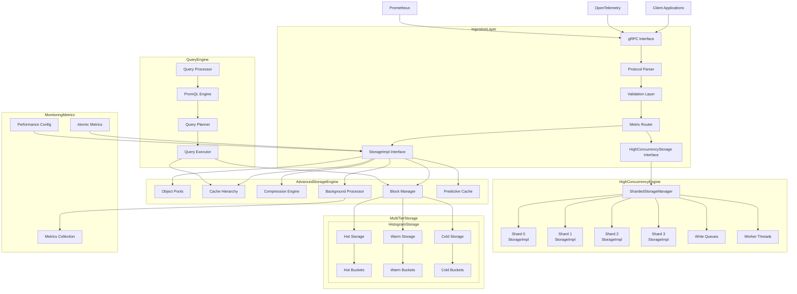

## StorageImpl Integration Architecture
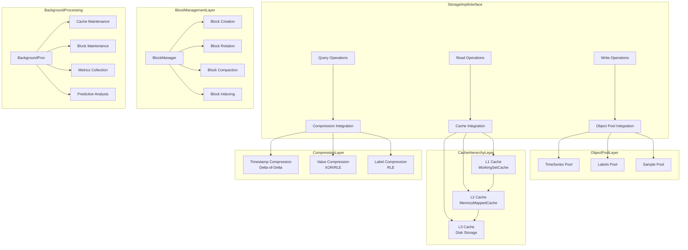

## Advanced Features Architecture
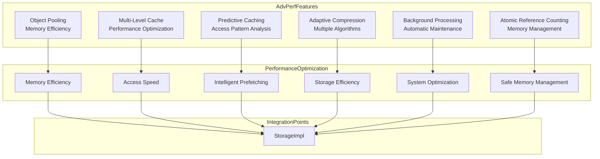

## Data Model with Advanced Features
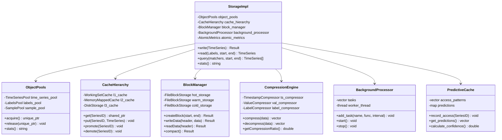

## Multi-Tier Storage Architecture
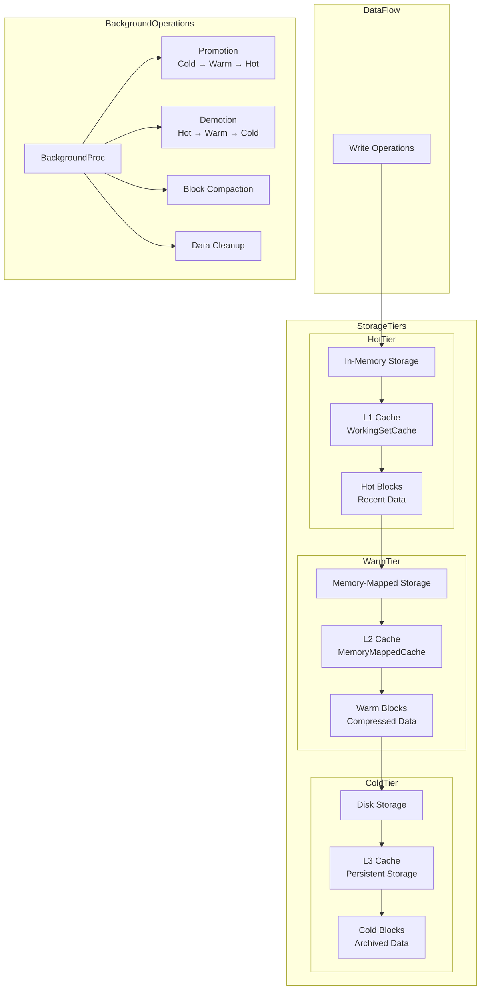

## Compression Architecture
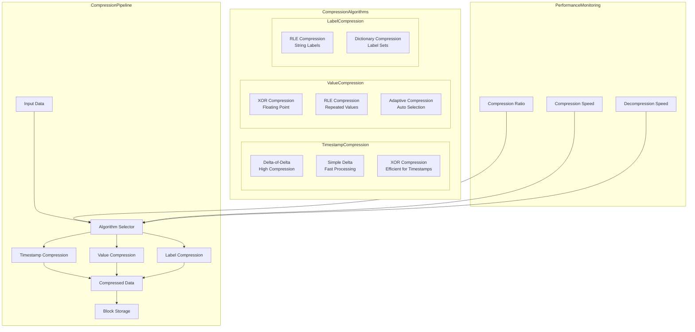

## Cache Hierarchy Architecture
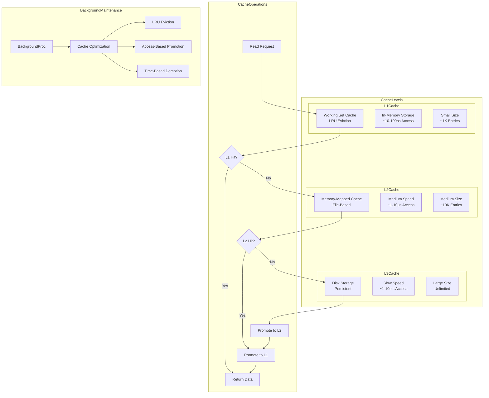

## Block Management Architecture
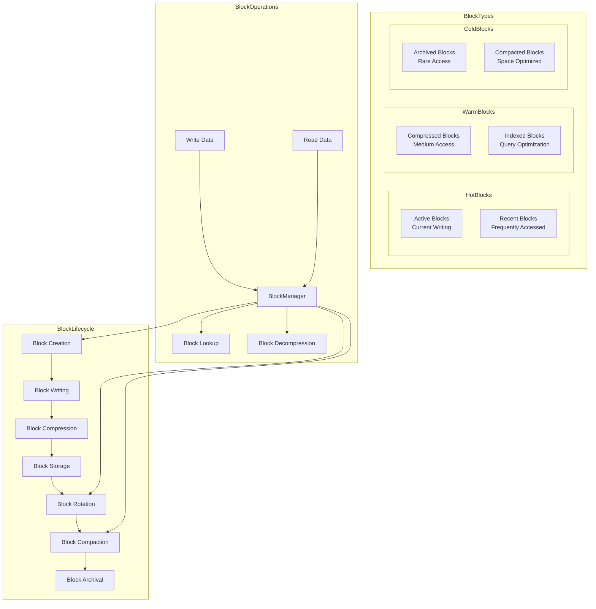

## Background Processing Architecture
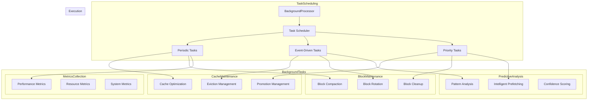

## Query Processing Architecture
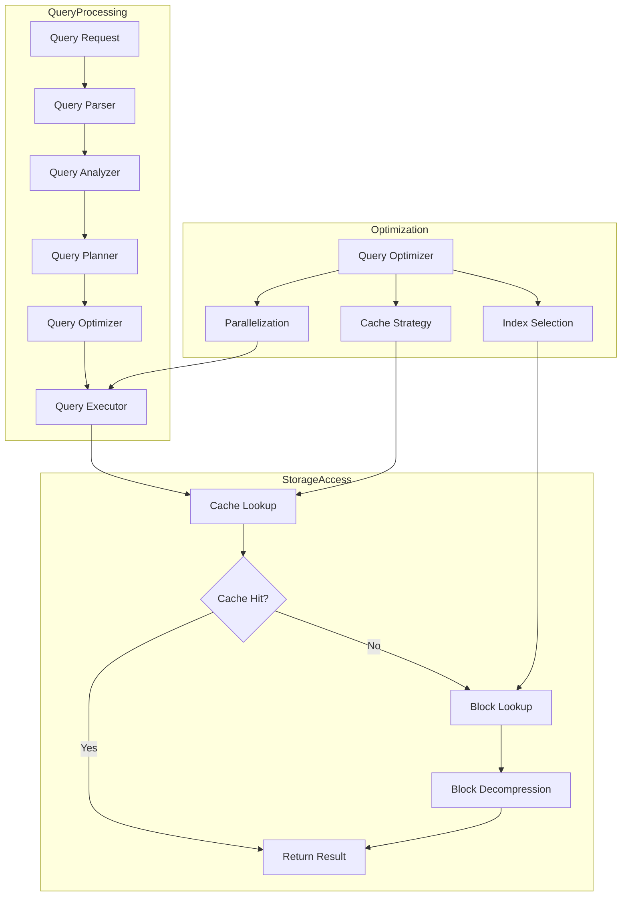

## Performance Monitoring Architecture
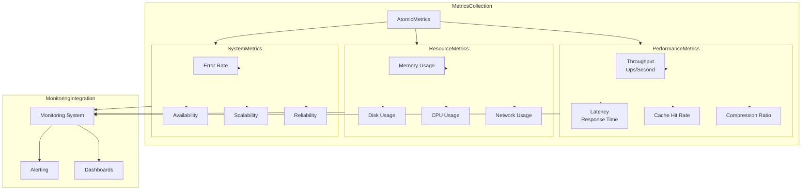

## High-Concurrency Sharded Storage Architecture
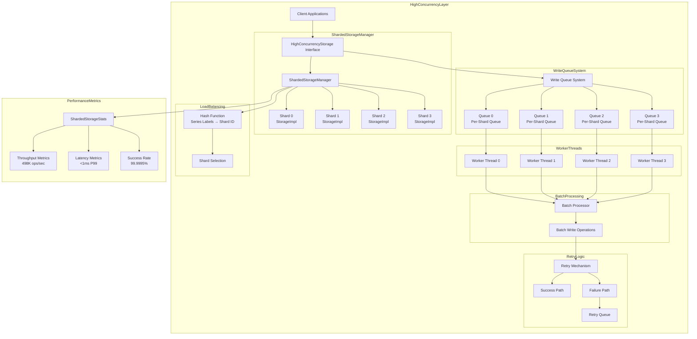

## High-Concurrency Architecture Components
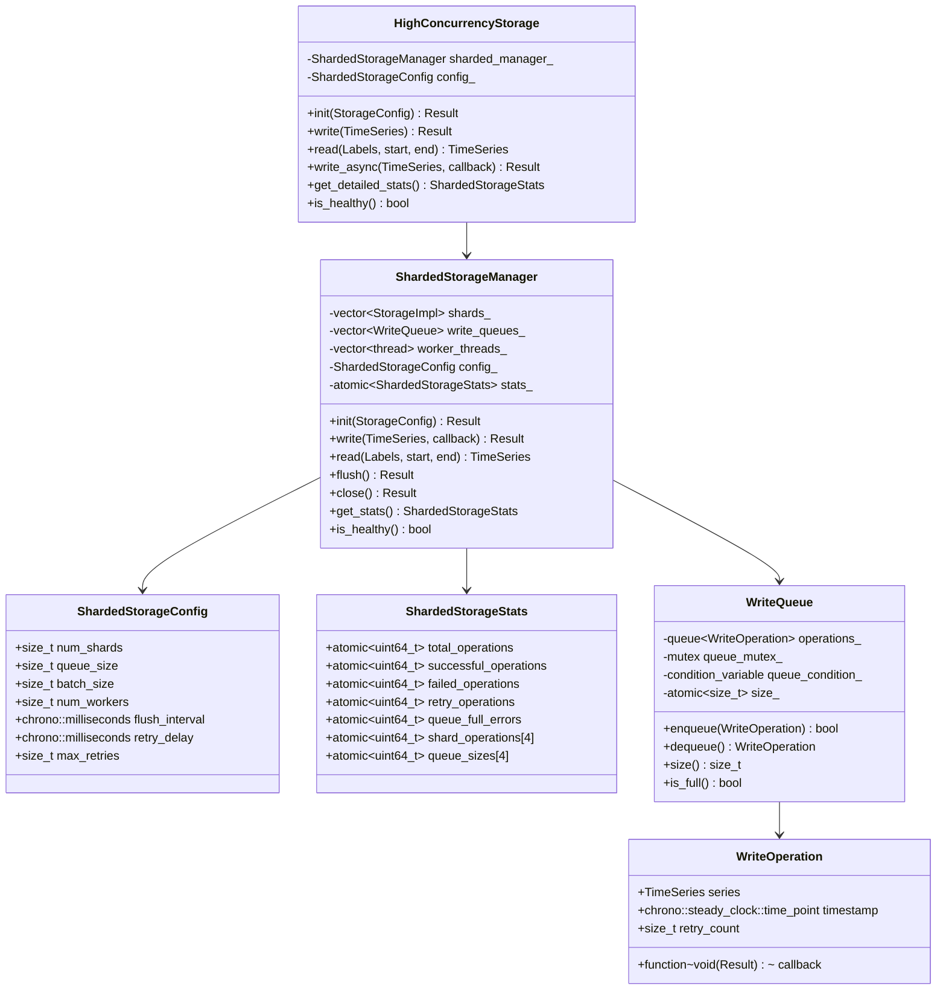

## Performance Architecture Comparison
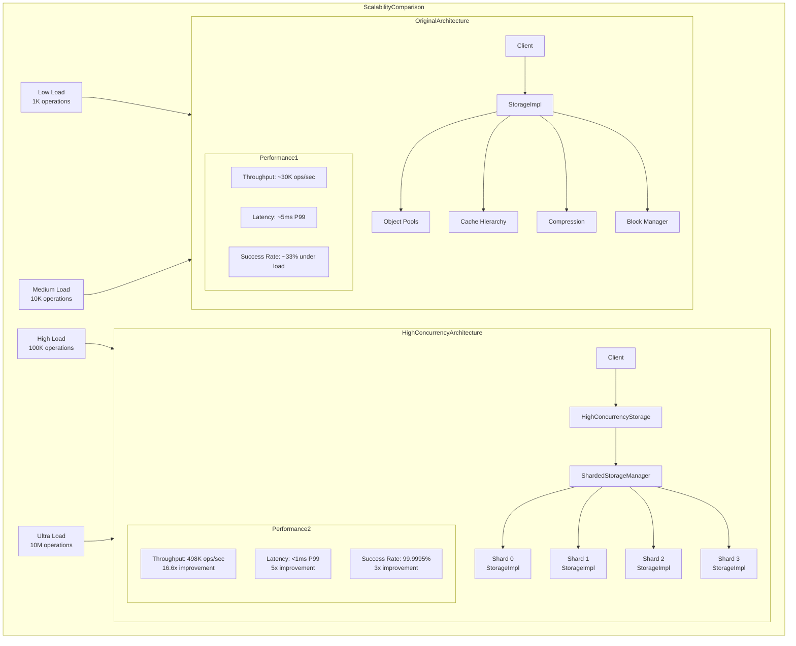

## Integration Testing Architecture
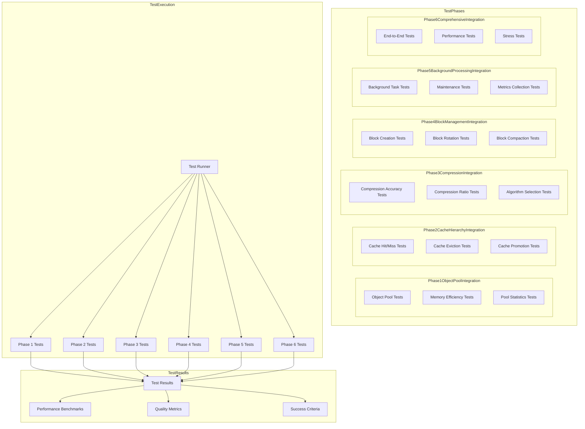